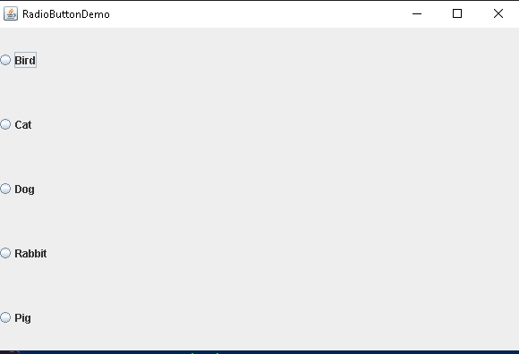
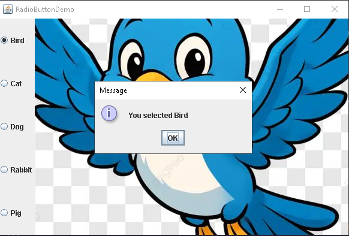
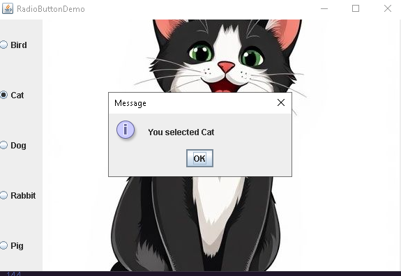
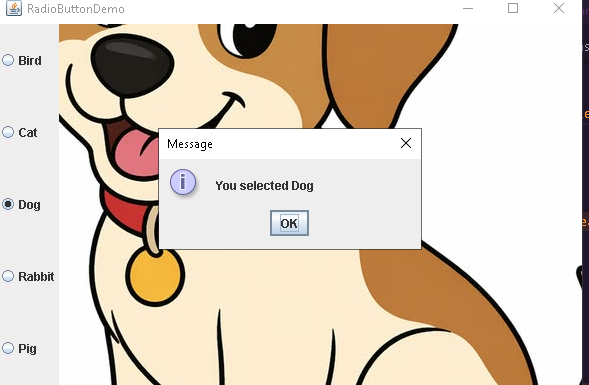
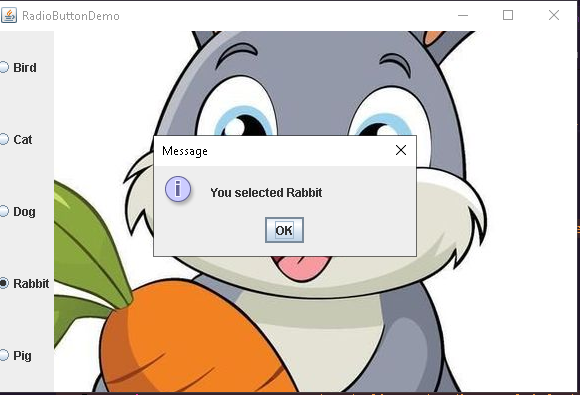
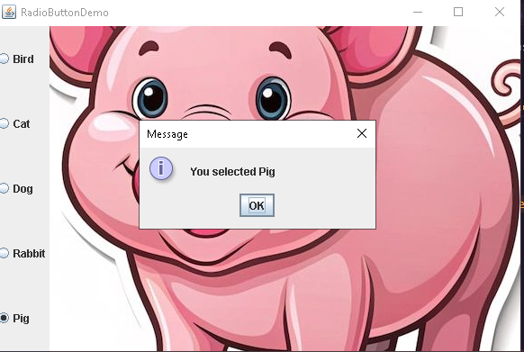

# Java Assignment 2 - Radio Button Demo

A simple Java Swing application that demonstrates the use of radio buttons to select different pets. When a pet is selected, its image is displayed and a message dialog confirms the user's selection.

---

## 📌 Assignment Objective

Create an application that uses five radio buttons to allow the user to choose which kind of pet is displayed.

The application should:

- Display five radio buttons
- Show the corresponding pet image
- Display the selected pet using a message dialog (`JOptionPane`)
- Allow only one radio button to be selected at a time

---

## 🛠 Technologies Used

- Java
- Java Swing
- VS Code
- JDK 17 (or later)

---

## 📂 Project Structure

```
JavaAssignment2/
│
├── RadioButtonDemo.java
├── images/
│   ├── bird.png
│   ├── cat.png
│   ├── dog.png
│   ├── rabbit.png
│   └── pig.png
│
├── screenshots/
│   ├── main-window.png
│   ├── bird-selected.png
│   ├── cat-selected.png
│   ├── dog-selected.png
│   ├── rabbit-selected.png
│   └── pig-selected.png
│
└── README.md
```

---

## 🚀 How to Run

### Compile

```bash
javac RadioButtonDemo.java
```

### Run

```bash
java RadioButtonDemo
```

---

## 📷 Screenshots

### Main Window



---

### Bird Selected



---

### Cat Selected



---

### Dog Selected



---

### Rabbit Selected



---

### Pig Selected



---

## 📖 Features

- Java Swing graphical interface
- Five radio buttons
- ButtonGroup for single selection
- Displays pet images dynamically
- Shows selected pet using a JOptionPane message dialog
- Easy to understand beginner-friendly code

---

## 👨‍💻 Author

**Prim5v**

GitHub: # Java Assignment 2 - Radio Button Demo

A simple Java Swing application that demonstrates the use of radio buttons to select different pets. When a pet is selected, its image is displayed and a message dialog confirms the user's selection.

---

## 📌 Assignment Objective

Create an application that uses five radio buttons to allow the user to choose which kind of pet is displayed.

The application should:

- Display five radio buttons
- Show the corresponding pet image
- Display the selected pet using a message dialog (`JOptionPane`)
- Allow only one radio button to be selected at a time

---

## 🛠 Technologies Used

- Java
- Java Swing
- VS Code
- JDK 17 (or later)

---

## 📂 Project Structure

```
JavaAssignment2/
│
├── RadioButtonDemo.java
├── images/
│   ├── bird.png
│   ├── cat.png
│   ├── dog.png
│   ├── rabbit.png
│   └── pig.png
│
├── screenshots/
│   ├── main-window.png
│   ├── bird-selected.png
│   ├── cat-selected.png
│   ├── dog-selected.png
│   ├── rabbit-selected.png
│   └── pig-selected.png
│
└── README.md
```

---

## 🚀 How to Run

### Compile

```bash
javac RadioButtonDemo.java
```

### Run

```bash
java RadioButtonDemo
```

---

## 📷 Screenshots

### Main Window


---

### Bird Selected


---

### Cat Selected


---

### Dog Selected


---

### Rabbit Selected


---

### Pig Selected


---

## 📖 Features

- Java Swing graphical interface
- Five radio buttons
- ButtonGroup for single selection
- Displays pet images dynamically
- Shows selected pet using a JOptionPane message dialog
- Easy to understand beginner-friendly code

---

## 👨‍💻 Author

**prim5v**

GitHub: https://github.com/prim5v
